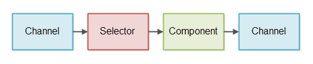
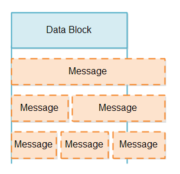

# JAVA NIO Non-blocking Server

即使你已经了解了 Java NIO 非阻塞模式的工作特性(Selector, Channel, Buffer等)，设计一个非阻塞的服务器依然很困难，相比于阻塞
的 IO 来说，非阻塞 IO 有很多挑战。本文将会讨论非阻塞服务器的几个难题，并给出一些可能的解决方案。

查找设计非阻塞服务器的资料信息是不容易的，因此，本文所提供的方案都是基于我个人的工作和想法之上的，如果你有更好的想法或者解决方案，
我会很高兴听取这些方案和想法，你可以写邮件或者在 Twitter 上联系我。

本教程描述的想法都是围绕 Java NIO 进行的，但是，我相信某些语言只要有类似 Selector 组件的话，文中的想法也可也用在这些语言上，
据我所知，这些组件都是底层操作系统提供的，所以对你来说你可以将此方法运用在其他语言上。

### GitHub 上的非阻塞服务器
我已经创建了一些简单的这些思想概念验证呈现在本教程，并将其放在 Github 上方便大家查看，以下是 Github 仓库地址：
```
https://github.com/jjenkov/java-nio-server
```

### 非阻塞 IO 管道
非阻塞 IO 管道是由一些处理非阻塞的 IO 组件组成的一个链，其中包括 IO 的读写操作，下图展示了一个简单的非阻塞 IO 管道。  



一个组件使用 Selector 检测 Channel 什么时候有可读的数据，这个组件读取输入数据，然后根据输入数据生成输出数据，
并将输出数据再次写入到 Channel 中。

一个非阻塞的 IO 管道可能不需要读数据和写数据都包含，有些可能只需要读数据，有些可能只需要写数据。

上图仅仅展示了一个组件，一个非阻塞的 IO 管道有不止一个组件处理输入数据，一个非阻塞管道的长度是由其所完成的功能决定的。

一个非阻塞的 IO 管道可能会同时从多个 Channel 中读取数据，例如，从多个 SocketChannel 中读取数据。

上图的控制流程太简单了，这里是组件通过 Selector 从 Channel 中读取数据，而不是 Channel 将数据推送给 Selector
进入组件，即使上图画的就是那样。

### 非阻塞 VS 阻塞的 IO 管道
非阻塞 IO 和阻塞 IO 的最大的不同在于他们如何从底层的 Channel(socket或者file) 中读取数据。

IO 管道通常从流中读取数据（来自socket或者file）,并且将这些数据拆分为一系列相关的消息。这就和使用 tokenizer 
将流数据解析为 token 一样。而此处，你只是将流数据解析为更大的消息，我将这种将流数据解析为消息体的组件称为“消息
读取器”，下图是消息读取器将流数据解析为消息的图示。


一个阻塞的 IO 管道，可以使用类似于 InputStream 那样的接口，每次只从底层的 Channel 中读取一个字节数据，并且这
个接口直到有数据到来之前一直阻塞，这就是阻塞的消息读取器的实现。

使用阻塞的 IO 接口简化了消息读取器的实现，一个阻塞的消息读取器从来不用处理流中没有数据可读，或者只读取流中
部分消息并且对于消息的恢复也要延迟处理的场景。

相同的，一个阻塞的消息写入器（将消息写到流中的组件）从来不处理只有部分数据写入并且写入的消息需要延迟处理的情况。

##### 阻塞 IO 管道的缺点
尽管阻塞的消息读取器是很容易实现的，但是它有一个明显的缺点：每一个分解成消息的流都需要启动一个单独的线程，必须这样
做的理由是每一个流的 IO 接口在从流中读取到数据之前一直阻塞，这也就意味着一个线程不能从一个没有数据的流中转移到另
一个流中去读取数据，一旦一个线程从一个流中读取数据，这个线程在它读取到数据之前将一直阻塞。

如果 IO 管道是处理大量并发链接服务器一部分的话，服务器将为每一个链接分配一个线程。对于一个在任何时刻只有几百个并发
的服务器来说这可能不是问题，但是，对于一个拥有几百万并发链接的服务器来说，这种设计就不具有良好的伸缩性。每一个线程
会占用 320K(32bit JVM)~1024K(64bit JVM)的内存，所以一百万个线程将消耗 1TB 的内存，在达到一百万之前服务器
已经用完了所有的内存来处理传过来的消息（例如：消息处理期间使用对象分配的内存）。

为了降低线程数，很多服务器采用线程池(例如：线程池的大小是100)的方式，从而一次一个的从入站链接中读取消息，入站链接
保存在一个队列中，线程按照链接入队的顺序处理每个链接，此设计如下图所示：


可是，这种设计需要入站链接合理的发送数据，如果入站链接长时间不活跃，那么大量的不活跃链接实际上导致了线程中线程的
阻塞。这意味着服务器响应变慢，甚至是不响应。

一些服务器通过弹性的调整线程池线程的数量来减轻这一问题，例如，如果线程池的线程不足时，线程池可能开启更多的线程处理
请求，这种方案意味着，需要大量的长连接才能使服务器变得不响应，但是，请记住，对于并发线程数是有一个上线的，因此，这
一方案仍然无法解决一百万个长时连接的问题。

### 基本的非阻塞 IO 管道设计
一个非阻塞的 IO 管道可以使用一个线程从多个流中读取消息，这需要可以被换到非阻塞模式。在非阻塞
模式下，当你尝试从一个流中读取数据的时候，可能会返回 0 个字节的数据也可能是多个字节的数据。当
没有数据可读的时候返回 0 个字节，当流中还有数据可读的时候返回多个字节。

为了避免检查流中是否有数据可读，我们使用 Java NIO Selector。一个或多个 SelectableChannel
实例被注册到 Selector 上，当你调用 Selector 的 select() 或者 selectNow() 方法它只会返回
有数据可读取的 SelectableChannel 的实例。设计如下图：


### 读取部分消息
当我们从 SelectableChannel 中读取一个数据块时，我们并不知道一个数据块是否包含一个完整的
数据信息，一个数据块可能包括部分数据信息，一个完整的数据信息，或者超过一个完整的数据信息，例如：
1.5 倍或者 2.5 倍的数据信息。一个数据块可能包含数据信息的情况如图所示：

在处理部分消息时，有两大挑战：
1. 检测数据块中是否有完整的数据信息
2. 在其余消息到达之前，我们如何处理已到达的部分数据信息  
判断消息的完整性需要消息读取器在数据块中寻找是否存在至少一个完整信息，如果数据块中包括一个或者
多个完整数据信息，这些信息将会被发送到管道中进行处理。寻找完整消息的处理过程可能会被重复很多次，
因此这一操作应该尽可能的快。

每当数据块中存在部分消息时，无论是单独消息还是一个或多个完整消息之后，都需要存储该部分消息，
直到该消息的其他部分从 Channel 中到达。

判断消息的完整性和存储消息都是消息读取器的责任，为了避免混淆来自不同 Channel 实例的消息，
我们将对每一个 Channel 使用一个消息读取器。设计如图所示：


当检索到有要从 Selector 中读取数据的 Channel 实例后，与该 Channel 相关联的消息读取器读取
数据并尝试将其分解为消息，如果能读取到完整消息，这些消息沿着读取管道传送到需要处理它们的任何组件。

消息读取器都是协议特定的，消息读取器需要知道它尝试读取的消息的格式，如果我们的服务器实现跨协议
重用，则需要能够插入消息读取器的实现-可能通过以某种方式接受消息读取器工厂作为配置参数。

### 存储部分消息
现在我们已经确定消息读取器有责任存储部分消息，直到收到完整消息，那么我们需要弄清楚这部分消息
的存储应如何实现。  
有两个设计因素我们需要考虑：  
1. 我们应该尽可能少的复制数据，复制越多，性能越低。  
2. 我们希望将完整的消息存储在连续的字节序列中，使得解析消息更容易  
很明显部分消息应该存储在某些缓冲区中，最直接最简单的实现是每一个消息读取器内部都有一个缓冲区，
但是这个缓冲区应该多大？它需要大到足够存储最大允许的消息，因此，如果最大允许的消息是 1MB，那
么消息读取器内部缓冲至少是 1MB。

当我们的链接达到百万的话，每个链接都使用 1MB并没有什么作用，1,000,000 * 1MB 仍然是 1TB的
内存，如果最大的消息是 16MB甚至是 128MB 呢？

##### 可扩展的缓冲
另一个选择是在消息读取器内部实现一个大小可调的缓冲区。大小可调的缓冲区一开始很小，如果它获取
的消息过大，那么缓冲区就扩大。这样每一个链接就不一定需要 1MB 的缓冲区，每条链接的缓冲区只需要
足够存储下一条消息的内存就行了。

有几种方式可以实现可扩展的缓冲区，它们各自都有自己的优点和缺点，下面我们一起讨论：

##### 通过复制调整大小
实现可扩展缓冲区的第一种方式是从一个小的缓冲区（例如4K）开始，如果 4K 的缓冲区装不下一个消息
，则会分配一个更大的缓冲区（如：8K），并将大小为 4K 的缓冲区数据复制这个更大的缓冲区中。

通过复制实现可扩展的缓冲区的优势是所有数据都被保存在一个连续的字节数组中，这就使得消息的解析
更加容易。

通过复制实现可扩展的缓冲区的缺点是如果是大的消息将导致大量的数据复制，降低性能。

为了减少数据的复制，你可以分析流进你系统的消息的大小，并找出尽量减少复制量的缓冲区的大小，例如：
你可能看到大多数消息小于 4K，这是因为它们都仅仅包含很小的 request/response，这意味着缓冲区
的初始值应该设置为 4K。

然后你可能看见有一个消息大于 4K，这通常是因为它里面包含一个文件，你可能注意到大多数流进系统的
文件都是小于 128K 的，这样第二个缓冲区设置为 128K 较为合理。

最后你可能会发现一旦消息超过 128K 之后，消息的大小就没有什么固定模式，因此缓冲区最终的大小
可能就是最大消息的大小。

根据流经系统消息的大小，上面三种缓冲区大小可以减少数据的复制，小于 4K 的消息将不会复制，对于
一百万个并发链接其结果是 1,000,000 * 4K = 4GB，对于当今大多数服务器来说还是可以接受的，
介于 4K ～ 128K 的消息将只会复制一次，也仅仅是 4K 的数据被复制到 128K 的缓冲区，介于 128K
到最大消息的大小也只需要复制两次，第一次复制 4K，第二次复制 128K，所以最大的消息总共复制了132K，
假定没有那么多超过 128K 大小的消息那还是可以接受的。

一旦消息处理完毕，那么分配的内存将会被释放，这样在同一链接接收到的下一条消息将会再次从最小缓冲区
大小开始算。这是确保在链接之间更有效的共享内存所必须的。很可能并非所有的链接都需要同时使用大缓冲区。

我这里有一篇介绍如何实现这样支持可调整大小的数组的内存缓冲区的完整文章，[Resizable Arrays](http://tutorials.jenkov.com/java-performance/resizable-array.html)
文章包含了一个 Github 仓库链接，其中的代码展示了如何实现的。

##### 通过追加调整大小
另一个调整缓冲区大小的方式是使缓冲区包含多个字节数组，当你需要调整缓冲区大小时，你只需要开辟
另一个字节数组并将数据写进去就行了。

有两种方式扩张一个缓冲区，一个方法是分配单独的字节数组，并将这些数据保存在一个列表中。另一个
方法是分配较大的共享字节数组的片段，然后保存分配给缓冲区的片段列表。个人而言，我觉得片段的方
式会更好一些，但是差别不大。

通过单独追加数组或片段来扩展缓冲区的有点在于写入的过程不需要复制数据，所有的数据可以直接从 Socket
中复制到数组或者片段中。

这种扩展缓冲区的缺点在于数据不是存储在单独且连续的数组中，这将使得消息的解析更加困难。因为解析
器需要同时查找每个单独数组的末尾和所有数组的末尾。由于你需要在写入的数据中查找消息的结尾，所以
该模型并不容易实现。

### TLV 编码消息


