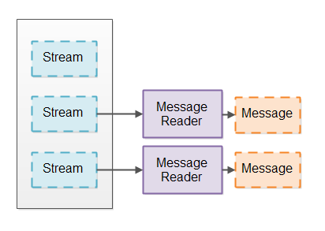

# JAVA NIO Non-blocking Server

即使你已经了解了 Java NIO 非阻塞模式的工作特性(Selector, Channel, Buffer等)，设计一个非阻塞的服务器依然很困难，相比于阻塞
的 IO 来说，非阻塞 IO 有很多挑战。本文将会讨论非阻塞服务器的几个难题，并给出一些可能的解决方案。

查找设计非阻塞服务器的资料信息是不容易的，因此，本文所提供的方案都是基于我个人的工作和想法之上的，如果你有更好的想法或者解决方案，
我会很高兴听取这些方案和想法，你可以写邮件或者在 Twitter 上联系我。

本教程描述的想法都是围绕 Java NIO 进行的，但是，我相信某些语言只要有类似 Selector 组件的话，文中的想法也可也用在这些语言上，
据我所知，这些组件都是底层操作系统提供的，所以对你来说你可以将此方法运用在其他语言上。

### GitHub 上的非阻塞服务器
我已经创建了一些简单的这些思想概念验证呈现在本教程，并将其放在 Github 上方便大家查看，以下是 Github 仓库地址：
```
https://github.com/jjenkov/java-nio-server
```

### 非阻塞 IO 管道
非阻塞 IO 管道是由一些处理非阻塞的 IO 组件组成的一个链，其中包括 IO 的读写操作，下图展示了一个简单的非阻塞 IO 管道。  


一个组件使用 Selector 检测 Channel 什么时候有可读的数据，这个组件读取输入数据，然后根据输入数据生成输出数据，
并将输出数据再次写入到 Channel 中。

一个非阻塞的 IO 管道可能不需要读数据和写数据都包含，有些可能只需要读数据，有些可能只需要写数据。

上图仅仅展示了一个组件，一个非阻塞的 IO 管道有不止一个组件处理输入数据，一个非阻塞管道的长度是由其所完成的功能决定的。

一个非阻塞的 IO 管道可能会同时从多个 Channel 中读取数据，例如，从多个 SocketChannel 中读取数据。

上图的控制流程太简单了，这里是组件通过 Selector 从 Channel 中读取数据，而不是 Channel 将数据推送给 Selector
进入组件，即使上图画的就是那样。

### 非阻塞 VS 阻塞的 IO 管道
非阻塞 IO 和阻塞 IO 的最大的不同在于他们如何从底层的 Channel(socket或者file) 中读取数据。

IO 管道通常从流中读取数据（来自socket或者file）,并且将这些数据拆分为一系列相关的消息。这就和使用 tokenizer 
将流数据解析为 token 一样。而此处，你只是将流数据解析为更大的消息，我将这种将流数据解析为消息体的组件称为“消息
读取器”，下图是消息读取器将流数据解析为消息的图示。


一个阻塞的 IO 管道，可以使用类似于 InputStream 那样的接口，每次只从底层的 Channel 中读取一个字节数据，并且这
个接口直到有数据到来之前一直阻塞，这就是阻塞的消息读取器的实现。

使用阻塞的 IO 接口简化了消息读取器的实现，一个阻塞的消息读取器从来不用处理流中没有数据可读，或者只读取流中
部分消息并且对于消息的恢复也要延迟处理的场景。

相同的，一个阻塞的消息写入器（将消息写到流中的组件）从来不处理只有部分数据写入并且写入的消息需要延迟处理的情况。

##### 阻塞 IO 管道的缺点
尽管阻塞的消息读取器是很容易实现的，但是它有一个明显的缺点：每一个分解成消息的流都需要启动一个单独的线程，必须这样
做的理由是每一个流的 IO 接口在从流中读取到数据之前一直阻塞，这也就意味着一个线程不能从一个没有数据的流中转移到另
一个流中去读取数据，一旦一个线程从一个流中读取数据，这个线程在它读取到数据之前将一直阻塞。

如果 IO 管道是处理大量并发链接服务器一部分的话，服务器将为每一个链接分配一个线程。对于一个在任何时刻只有几百个并发
的服务器来说这可能不是问题，但是，对于一个拥有几百万并发链接的服务器来说，这种设计就不具有良好的伸缩性。每一个线程
会占用 320K(32bit JVM)~1024K(64bit JVM)的内存，所以一百万个线程将消耗 1TB 的内存，在达到一百万之前服务器
已经用完了所有的内存来处理传过来的消息（例如：消息处理期间使用对象分配的内存）。

为了降低线程数，很多服务器采用线程池(例如：线程池的大小是100)的方式，从而一次一个的从入站链接中读取消息，入站链接
保存在一个队列中，线程按照链接入队的顺序处理每个链接，此设计如下图所示：


可是，这种设计需要入站链接合理的发送数据，如果入站链接长时间不活跃，那么大量的不活跃链接实际上导致了线程中线程的
阻塞。这意味着服务器响应变慢，甚至是不响应。

一些服务器通过弹性的调整线程池线程的数量来减轻这一问题，例如，如果线程池的线程不足时，线程池可能开启更多的线程处理
请求，这种方案意味着，需要大量的长连接才能使服务器变得不响应，但是，请记住，对于并发线程数是有一个上线的，因此，这
一方案仍然无法解决一百万个长时连接的问题。


